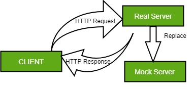

## Mock
A mock, in software engineering, is a simulated object or module that acts as a stand-in for a real object or module. Mocks are often used in testing to isolate the behavior of a particular module or component and to verify that it behaves as expected



## Wiremock

Python WireMock is a library that allows users to interact with a WireMock instance from within a Python project.


## Stub
A stub is a controllable replacement for an Existing Dependency (or collaborator) in the system. By using a stub, you can test your code without dealing with the dependency directly

> download wiremock image

```shell
  docker pull wiremock/wiremock:latest
```

> run wiremock

```shell
  docker run -it --rm -p 8080:8080 --name wiremock wiremock/wiremock:latest
```

Example image after run the command


> go to URL: http://localhost:8080/__admin/swagger-ui/


## Wiremock client

To install:
```shell
  pip install wiremock
```

To install with testing dependencies:
```shell
  pip install wiremock[testing]
```


## References:

https://wiremock.org/docs/solutions/python/
